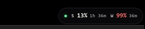

# Claude Usage Bar

A frosted translucent pill pinned above the Windows clock showing Claude Code session and weekly usage — with a breathing live dot.




| Label | Meaning |
|-------|---------|
| **S** | 5-hour session usage % |
| **W** | 7-day weekly usage % |
| countdown | time until that window resets |

Color thresholds: cream < 75% — amber 75–89% — red ≥ 90%

---

## Requirements

- Windows 10 or 11
- Python 3.10+
- [Pillow](https://pypi.org/project/pillow/) (`pip install pillow`)
- Consolas Bold font (ships with Windows)

---

## Quick start

```bash
pip install pillow
python make_icon.py           # generates claude-usage.ico (run once)
pythonw claude_usage_bar.pyw  # launch — no console window
```

The pill appears above your clock, top-right. Right-click to refresh or quit.

---

## Auto-start on boot

1. Press `Win + R` and run: `shell:startup`
2. Create a shortcut to `claude_usage_bar.pyw` in that folder.
3. Set the shortcut icon to `claude-usage.ico`.

---

## Usage

| Action | Effect |
|--------|--------|
| Right-click | Refresh now / Quit |
| Auto | Refreshes every 2 minutes, countdown ticks live |
| Crash | Auto-restarts with exponential backoff (5s → 60s max) |

---

## How it works

Reads from the Claude API using the same OAuth token Claude Code stores at `~/.claude/.credentials.json`. No extra setup — if Claude Code is authenticated, this works automatically.

Rendered via `UpdateLayeredWindow` (per-pixel alpha) so the frosted pill looks correct on any desktop background.

---

## License

MIT
